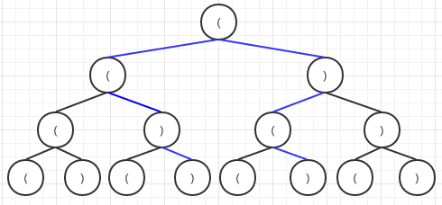

[22. Generate Parentheses](https://leetcode.com/problems/generate-parentheses/)
==========================

原题
----

Given *n* pairs of parentheses, write a function to generate all
combinations of well-formed parentheses.

For example, given *n=3*, a solution set is:

```
[
  "((()))",
  "(()())",
  "(())()",
  "()(())",
  "()()()"
]
```

思路
----

1. 可以将其视为而叉树，从根节点(左括号开始)到叶子节点形成一个正确括号
   的组合。下图展示了当 *n=2* 时的二叉树图形，其中蓝色线表明是匹配的括
   号。
   
   

代码
----

思路1示例代码
```c++
class Solution {
public:
	vector<string> generateParenthesis(int n) {
		vector<string> results;
		helper(results, "", n, n);
		return results;
	}
	
	void helper(vector<string>& res, string parenthesis, int left, int right) {
		if (right == 0) {
			res.push_back(parenthesis);
		}
		
		if (left > 0) {
			helper(res, parenthesis + "(", left - 1, right);
		}
		
		if (left < right) {
			helper(res, parenthesis + ")", left, right - 1);
		}
	}
};
```
